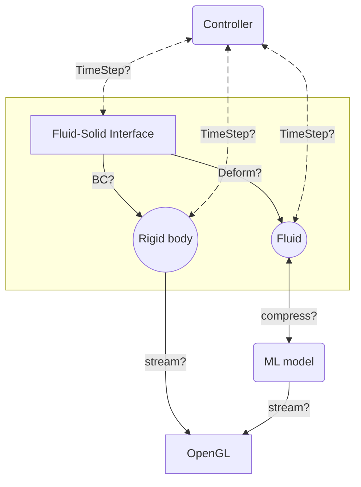

# MeshlessFlow: Framework overview

The **C**omponent-to-**C**omponent **I**nterface **P**rotocol

- Treating CFD simulations as compositions of independent components
- Each module interacts via **capabilities** negotiated through a language-agnostic protocol
  - Much like the Language Server Protocol in IDEs
  - Capabilities include:
    - MeshlessPDE: Can build and solve PDEs
    - Configurable: Communicates standard config
    - BoundingBox: Computes its bounding boxes

::right::

 

<v-click>

</v-click>

---
transition: fade-in
hideInToc: True
layout: two-cols
---

# MeshlessFlow: Framework overview

The **C**omponent-to-**C**omponent **I**nterface **P**rotocol

- Capability-negotiation mechanism triggers at initialization phase
- A "Component" is either a process or an MPI group
- Efficient communication channels are then established (raw object streams, MPI***)
- Use what you already have! An FVM-based solver can behave as a component.

::right::

 
 

> CCIP is nothing but an abuse of the region-based methodology of
> [multiRegionFoam](https://github.com/hmarschall/multiRegionFoam) <Citation citeKey="Alkafri2024" position="left" citeElevation="bottom-12" />,
> initially designed for region-region convenient coupling

 
<CCIP />

<mdi-handshake class="text-3xl mx-2" style="position: absolute; top:370px; left:640px; color: var(--slidev-theme-warn);" />
<mdi-handshake class="text-3xl mx-2" style="position: absolute; top:370px; left:750px; color: var(--slidev-theme-warn); transform: scaleX(-1);" />

---
transition: fade-in
layout: two-cols
---

# A case study: Bouncing rigid bodies

<SlidevVideo width="500px" controls autoplay>
  <source src="/videos/BoundingRigidBodies.webm" type="video/webm" />
  

    Your browser does not support Webm videos. You may download it
    <a href="/videos/BoundingRigidBodies.webm">here</a>.
  

</SlidevVideo>

::right::

     

- **Method**: Particle-based rigid body, using SPH infrastructure
- Contact Forces and Collisions -> Moment -> Motion
- Explicit time integration
- **Kernel Function**: Quintic Spline
- No global linear system solved

---
hideInToc: True
transition: fade-in
---

# A case study: Bouncing rigid bodies

The Quintic Spline kernel
$$
  W(r, h) = \alpha_n \times
  \begin{cases}
  (3 - \frac{r}{h})^5 - 6(2 - \frac{r}{h})^5 + 15(1 - \frac{r}{h})^5, & 0 \leq \frac{r}{h} < 1 \\
  (3 - \frac{r}{h})^5 - 6(2 - \frac{r}{h})^5, & 1 \leq \frac{r}{h} < 2 \\
  (3 - \frac{r}{h})^5, & 2 \leq \frac{r}{h} < 3 \\
  0, & \frac{r}{h} \geq 3
  \end{cases}
$$

Notable properties:

- Large support radius
- Smoother pressure gradients (through $C^4$ continuity)
- Probably over-kill for this case...

---
transition: fade-in
layout: two-cols
---

# A case study: Sinking rigid bodies (2D)

<SlidevVideo width="500px" controls autoplay>
  <source src="/videos/SinkingRigidBodies.webm" type="video/webm" />
  

    Your browser does not support Webm videos. You may download it
    <a href="/videos/SinkingRigidBodies.webm">here</a>.
  

</SlidevVideo>

::right::

     

- **Method**: Weakly compressible SPH, Tait EOS, Momentum has artificial viscosity
- Coupling interface: Akinci Rigid-body Fluid coupling
- Explicit time integration
- **Kernel Function**: Quintic Spline
- No global linear system solved
