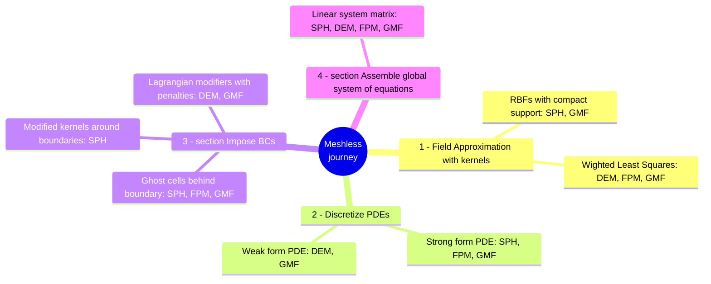

# Is it only about SPH?

Current implementation status for different meshless methods in MeshlessFlow

::right::

   

Strong form solutions mostly follow <Citation citeKey="Slak2021" position="left" citeElevation="bottom-12" />; 
for an extensive overview: <Citation citeKey="Li2013" position="right" citeElevation="bottom-12" />

---
transition: fade-in
layout: center
---

# What's next?

- More SPHERIC Grand challenges: Established validation cases
- Full Parallelization
- User Interface
- Coupling with OpenFOAM FVM-based solvers
