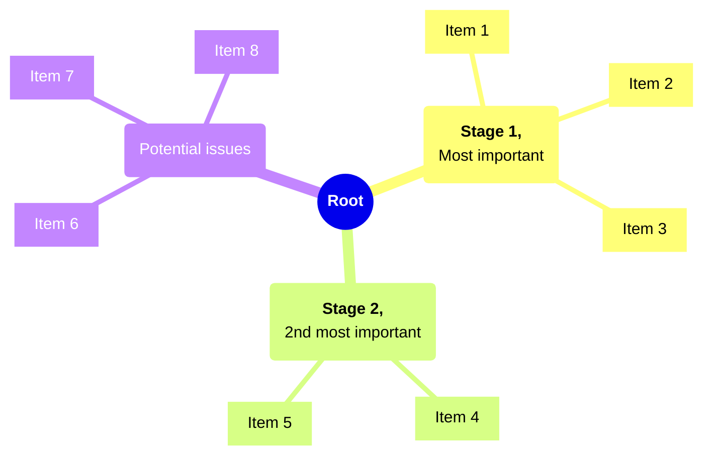
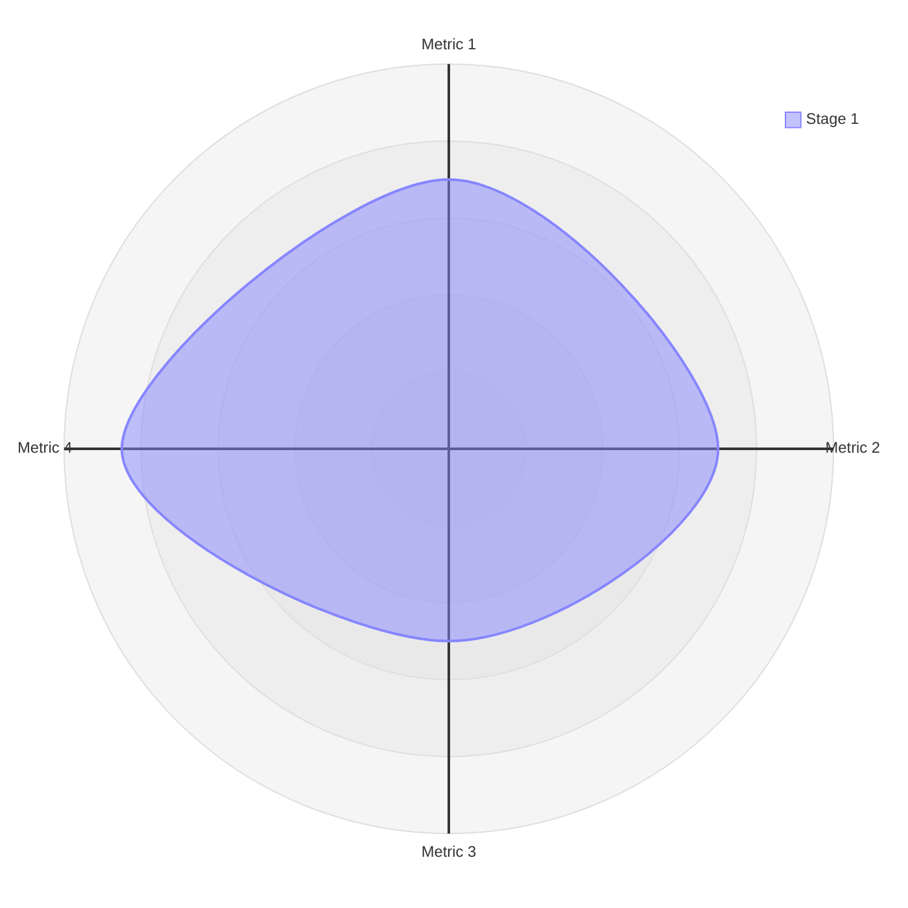

# Meshless methods? With OpenFOAM?

+ Issues with mesh-based methods?
  - Excessive computational costs for industrial cases
  - Some industries moving towards NURBS
  - Dependence on mesh quality
- Go meshless?
  - Giving up the high fidelity

---
transition: fade-out
---

# A Mermaid mindmap




---
transition: fade-out
hideInToc: false
---

# Disclaimers

<br/>

> #### This is a nice note
> And this is what the note's body looks like.

<br/>
<v-click at="1">

> #### On-click reveals
> Beamer-style reveals are hard to beat!

</v-click>
<br/>
<v-click at="2">

Regular **markdown** _text_ can also be "clicked"!
- as a whole like this paragraph

</v-click>

<v-clicks at="3">

- or by items (for lists only)

</v-clicks>

---
transition: fade-out
hideInToc: false
---

# Code snippets

<br/>
Highlighting parts of code snippets is important!

```bash {all|2}
apptainer pull c.sif oras://ghcr.io/blah/blah
apptainer run c.sif info
```


But can also run Python stuff! This snippet is editable too!
```python {monaco-run} {autorun:false}
def func():
    print("Yay!")
func()
```

Focus on the diffs if you need to!
```python {monaco-diff}
    print("Yay!")
~~~
    print("ZZZZ")
```

---
transition: fade-in
layout: two-cols
layoutClass: gap-16
---

# Split into two columns
And point with arrows

<br/> <br/>
<v-clicks>

1. Arrows defined inside inside a "clicks" overlay 
   <Arrow v-bind="{ x1:450, y1:210, x2:700, y2:145 }" color="var(--slidev-theme-error)" />
1. Also get "clicked". Look at this cool Mermaid radar!
     <Arrow v-bind="{ x1:450, y1:250, x2:560, y2:295 }" color="var(--slidev-theme-primary)" />
1. Normal text here with a citation to <Citation citeKey="doe2020" position="right" citeElevation="bottom-8" />
   and maybe <Citation citeKey="smith2021" citeElevation="bottom-12" :divider="false" /> without a top divider.
   <Arrow v-bind="{ x1:450, y1:310, x2:550, y2:465 }" color="var(--slidev-theme-error)" />
   <Arrow v-bind="{ x1:250, y1:350, x2:250, y2:455 }" color="var(--slidev-theme-primary)" />

</v-clicks>

::right::

<br/><br/>



---
transition: fade-in
---

The citation index continues <Citation citeKey="lee2022" position="right" citeElevation="bottom-12" /> 

```bash
# Put your Latex references in references.bib file and:
REFERENCES_BIB=references.bib REFERECES_STYLE=apa rpm run references
npm run dev
```

Currently the following styles are supported (from CSL, for more info visit the Github page): <a class="absolute right-15 text-xl i-carbon:logo-github" href="https://github.com/citation-js/citation-js/tree/main/packages/plugin-csl
"> </a>
- `apa`
- `karvard1`
- `vancouver`

Inline math $\sqrt{3x-1}+(1+x)^2$ can attach to <Citation citeKey="smith2021" citeElevation="bottom-12" />.
Math blocks look like this :


$$
\begin{aligned}
\nabla \cdot \vec{E} &= \frac{\rho}{\varepsilon_0} \\
\end{aligned}
$$

---
transition: fade-in
---

## First-class ADR support

<br/>
<AdrTable :headerRow="true" :maxItems="4" />

<br/>

```bash
ADR_PATH=/my/repo/ADRs ADR_REPO=https://github.com/blah/blah ADR_REF=main npm run adr
npm run dev
```
